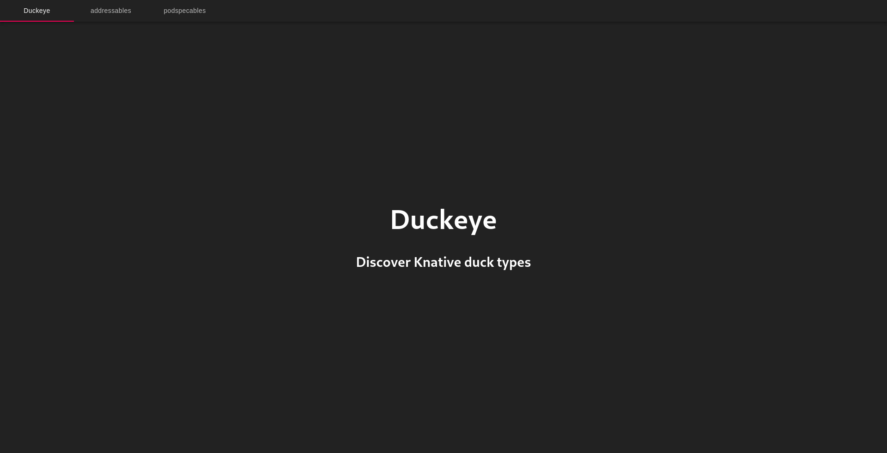
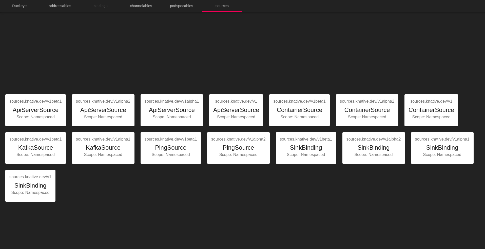

# Duckeye

Duckeye lets you view Knative types in your browser.



# Usage

## Installation

1. Download Duckeye from the latest [release](https://github.com/pierDipi/duckeye/releases),
and then install it by entering the following command:

    ```bash
    kubectl apply -f duckeye.yaml
    ```
   
2. Access the UI by entering the following command:

    ```bash
    kubectl port-forward -n knative-discovery svc/duckeye 8080:80
    ```
---

## Viewing Ducks

Once Eventing is installed you'll see tabs that shows Addressables, Sources, etc.



### Resources:

- [Knative](https://knative.dev) 
- [Knative Discovery](https://github.com/knative-sandbox/discovery)
